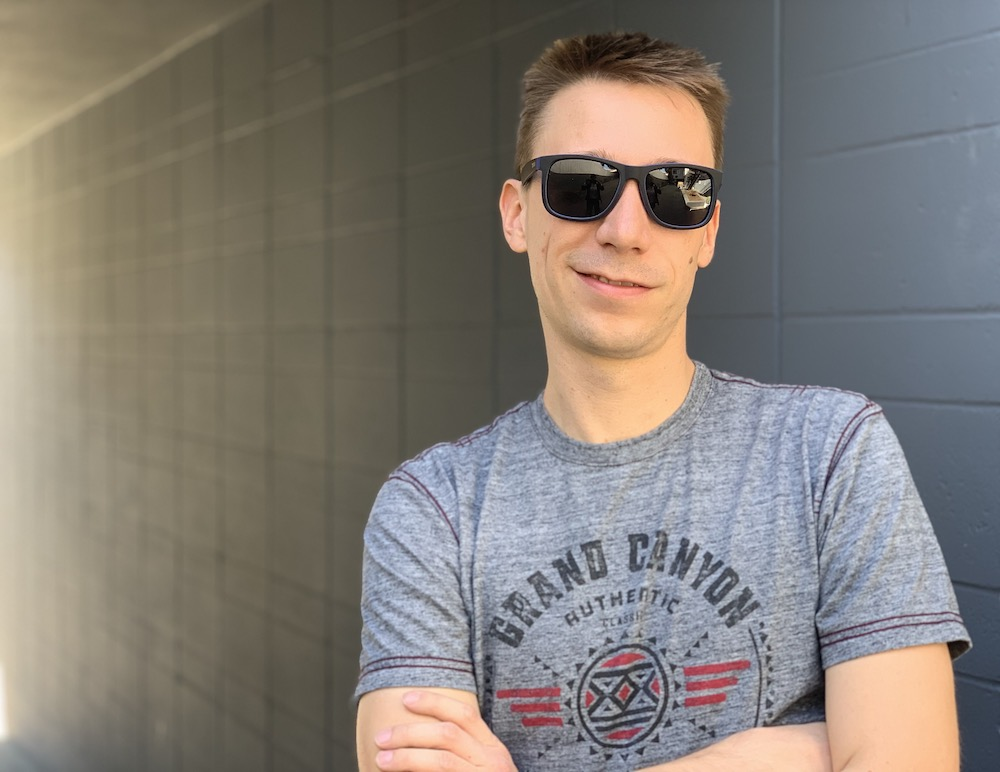

Hi there, my name is Leif I am a German living in California.

I'm a developer by trade and by heart :heart:. I enjoy tinkering around with code and sometimes I [talk](https://speakerdeck.com/leifg) about it. I have particularly strong opinions on blockchain technologies. All my posts regarding this topic can be found under [Schlockchain](/schlockchain). All other articles can be found under [blog](/blog).

For my professional credentials refer to my [LinkedIn Page](http://linkedin.com/in/lgensert/).

Besides friends, family and my [amazing wife](https://www.linkedin.com/in/louisemeylan/) here are some other things I love:

- Hedgehogs
- Puns on my first name (It's pronounced like 'life')
- EDM Remixes of [Philipp Poisel Songs](https://soundcloud.com/jeanmuzikaofficial/philipp-poisel-wie-soll-ein-mensch-das-ertragen-jeanmuzika-edit)
- Punk rock albums released during the Bush era
- Craft beer that tastes like mango
