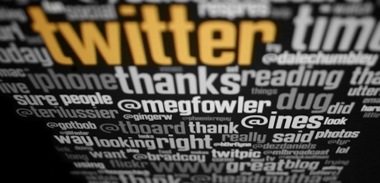

The most controversial "community" has finally taken off into mainstream. So a lot of people are asking themselves: "how can I get rich using this service". That is a valid question. A lot of so called "consultants" or "experts" are trying to help with this question and make up rules on "how to use twitter".

I think I'll join this conversation:

1. Don't follow back people **only** because they followed you. This is not facebook, following doesn't have to be mutual.
2. Unfollow people that don't interest you (anymore).

OK, that's it. For the rest do whatever you want. Thanks for listening.

picture taken by [respres](http://www.flickr.com/photos/respres/3231178720/)/[CC BY 2.0 ](http://creativecommons.org/licenses/by/2.0/deed.en)
