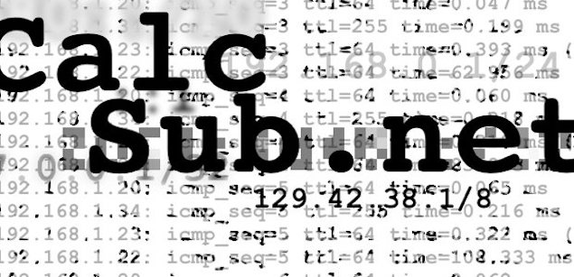

Over the easter holidays I started working on a new project. Today it has finally reached a state where I'm confident to say: I can go public.

It's just a simple subnet calculator that takes IPv4 and IPv6 addresses and then calculates the start address and the end address.

You can have a look at it [here (NON FUNCTIONAL)](https://web.archive.org/web/20130601060932/http://calcsub.net/) or see the source on [github](https://github.com/leifg/calcsub.net).

picture created by Leif Gensert. [CC BY 2.0](http://creativecommons.org/licenses/by/2.0/)
