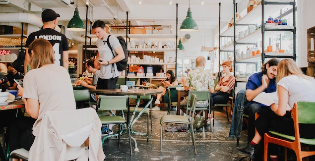

There are good reasons why you can't or don't want to work out of a classic office. Some have to do with working remotely, some are just due to the reason that your company is too small to rent out a complete office space.

When this is the case you have several options; there are the people who like to work from home and there are the people who hang out in coffee shops all day. Somewhere in between, there are the coworking spaces.

This is my preferred way of working when I'm not at a client's office. Throughout my career, I have traveled quite a bit and have seen a bunch of coworking spaces.

I find it hard to pin down criteria that I personally think make a good coworking space. But I can definitely tell you some of my gripes I have with some of the spaces I happened to work in. So if you happen to avoid most (or even all) of the following annoyances you have a good chance of ranking pretty high on my favorite list.

Be aware, this is a rant.

## Paper Sign up Forms

If you make fill out a piece of paper when I stumble into your space for the first time I can guarantee you an eye-roll immediately. You cannot claim to shape "the future of work" and then expect me to scribble down my information on an ancient piece of technology (literally). What are you going to do with that piece of paper anyway? I suppose you are going to enter it into some kind of IT system. So why not give me access to this system? If your tax lawyer, the government or your grandma needs paper copies, just print it out. But leave me out of this process.

## No Separation between Noisy and Quiet Area

When I finally sign up and go start working I need to know the rules. If there is only one giant room with people sitting in it, I will be confused. What's the deal here? Cannot take calls? Am I allowed to speak to my neighbor? Make it clear where to socialize and where to shut up.

## No phone booths

Even if you have separate areas for chatting and working, taking calls can be tricky. In the quiet zone I will definitely annoy my surroundings with calls and in the chatty area everyone else will annoy me while taking calls. So in order to solve this a third dedicated call area is a neat solution to this problem.

## No Dishwasher

I have noticed the following scenario in multiple coworking spaces: there is a sink and everybody puts their dirty dishes in it. Usually, there is already a sign saying "Do your dishes", sometimes with a passive aggressive addition like "your mom is not here". Also very common: after a while, a less passive more aggressive email is sent via internal communication channels that reads something like "If this behavior continues I'm gonna take all the dishes from you..."

I often wonder: does anyone really think a sign and continuous emails is the best solution for this problem? A dishwater is not the ultimate solution but a way more effective one. So please account for a dishwasher from the beginning.

## No office equipment

I get it. It's great to post on Instagram how you are sitting on a tiny table with a handcrafted wooden chair made out of organically sourced bamboo. Ideally, you'd also have a soy Chai Latte and an organic carrot cake with you in the picture.

In fact, most of the pictures I found when searching for "coworking space" in some way or another portray very artistic places (example at the top).

Call me a corporate sellout but I am not able to work in an environment like this for more than 2 hours. After this, my back and my neck seriously start to hurt. So if you call yourself a co**working** space, please invest in proper office equipment (most importantly: office chairs).

## No (Free) Water

We've all seen these posts on how important it is to stay hydrated. Though it's highly debated how much water you actually you need, 0 is definitely not enough. Providing a water cooler or even just glasses (given the tap water is drinkable) can go a long way.

## No Community Management

Coworking spaces have one giant advantage over working from home: you are surrounded by people in a similar situation, yet most of them work on something different. There is a lot of potential for networking or just making friends. I myself am pretty open and easy going but I always have a problem approaching random people.

It is a lot easier for me to start conversations online. Usually, a Slack or Facebook group can help a lot here. When people need help with something that I can help with, I'm very willing to have a short meeting (around the water cooler).

Bonus points if you have event or techniques to encourage communication between members. One technique I particularly liked was to randomly pair up people for lunch (of course: make it optional).

## Conclusion

So I already hear your objections: "Why not bring your own water?", "Is doing your dishes really that bad?", "just go outside to take a call". And some of your statements might be true. I am perfectly aware that I can do something about any of the annoyances. But solving little problems will take away energy from what I actually want to do in a coworking space: **work** and occasionally **socialize**.

So if you run a coworking space: **Make it easy** and you'll win me as a happy client.
