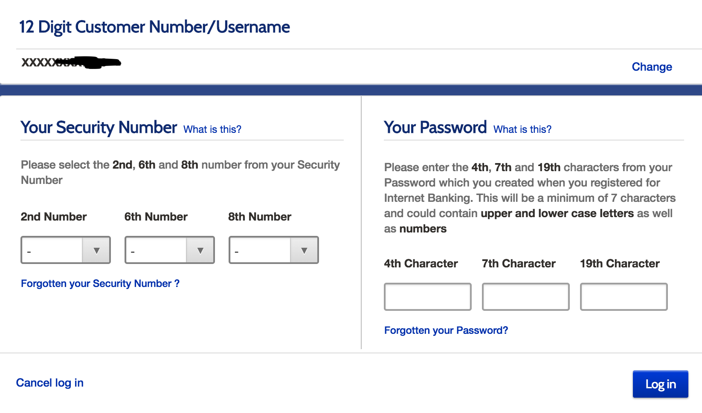
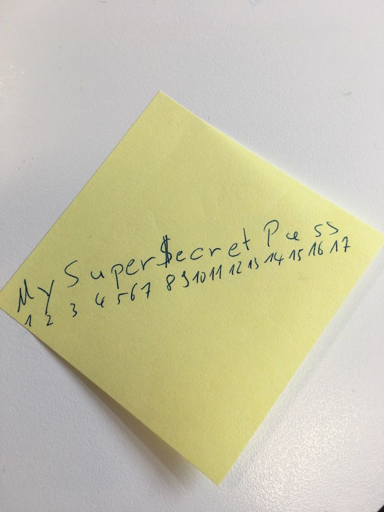

**Disclaimer:** I'm not a security expert. But to quote one of my favorite comedians [Steve Hoffstetter](https://www.scarymommy.com/mom-heckles-comedian-steve-hofstetter-viral-video/).

> I've never flown a helicopter. But if I saw one in a tree, I could still be like, 'Dude fucked up'.

So here is what this helicopter in a tree looked for me:

This is the login screen for [Metro Bank](https://Metro Bankonline.co.uk/), a UK based bank. This screen will only show up if you entered an existing customer number. I will go into detail what is wrong with it. But first a little bit about the "security concept" that Metro Bank has.

On opening an account you will be assigned a 12 digit customer number, this will act as your username. In addition to that you will choose a password (nothing special here). But that is not enough. Furthermore you will need to choose a security number which is an 8 digit number. I should also mention that you will also have to select 3 preselected security question, which are irrelevant for the login process.

After you enter your user name (or customer number) you will be prompted with the screen above. To log in, you'll need to provide your security number and password. But you don't enter the whole thing. You will be prompted entering certain positions of both security number and password. The positions switch everytime you are on the login screen.

OK, so what's wrong with that?

## It is Horrible User Experience

Among all the points that I am trying to make, this is the one that personally bugs me the most. Every time I need to do anything with my bank account I check if it's possible to do via app (at least there I'm constantly logged in). Because going through this screen is such a pain. I am not able to use my password manager for this screen, I always have to go and actually look up my password. And the only way to actually make this work somehow efficient is to compromise the sensitivity of my password. Which brings me to the next point.

## It incentivizes Users to write down their Password

Question: think of a super secure password, use a password generator if you like. Got it? OK question: What's the 4th, 7th an 19th character of that password?

I'm waiting ...

Exactly you have now idea. The only way you can actually know this is if your password is something like "12345678901234567890" or any other recognizable pattern. Not a great idea ...

The other option is doing this:

Writing down your password and numbering the individual characters. Also not a great idea. I know that there are compromises and if you go through this process often enough you get the hang of it. I now have a good routine with the [1Password enlarge password feature](https://support.1password.com/getting-started-mac/#enlarge-passwords)but flashing your password on your screen is also not a great option.

## It exposes certain security features of the Passwords

If you come across an existing customer number on achieve to reach the login screen it will always ask you for different letters from the password. That means if you refresh that screen often enough, you will see different permutations. In the example above you can see that my password contains at least 19 characters. Do that often enough and you can narrow it down even further. If you were trying to guess a password knowing how many characters there are, drastically reduces the amount of guessing you need to do. Granted the login page shuts down after three tries but this is more a matter of principle: "Don't expose any features of the passwords".

**Side note:** I have no idea how hard it is to come across an existing customer number. However Metro Bank also provides the possibility to create an alias that you can provide instead of the customer number. Given that most people probably use some variation of first name / last name it should be fairly simple to guess an existing alias.

## Metro Bank most certainly stores passwords in cleartext

This one is by far the biggest issue with the login screen from a security standpoint. But let me expand a little bit.

When it comes to handling and storing passwords, there are a couple of best practices. I am not going to go into the details but the gist of it is:

**Do not store your password so that it can be retrieved in any way.**

As of April 2020, the most common practice is to store a hash of a password that cannot be reverted back to the original password.  There is a great video by the Youtube Channel [Computerphile](https://www.youtube.com/channel/UC9-y-6csu5WGm29I7JiwpnA) that explains this procedure in detail.

My point is: judging by the way Metro Bank asks for passwords I don't see any technical way (I urge security experts to correct me here) on how to store a hash of a passwords and at the same time be able to confirm arbitrary letters of the original password.

Bottom line: I am pretty sure, that Metro Bank  is able to retrieve the password of every single user in its original form.

## Conclusion

Even though Metro Bank takes extra measurements to secure the account (enforced 2nd factor for logins on new devices, additional security questions and 2nd factors for new payment recipients) this login screens completely fails on two aspects when comparing it to regular password inputs.

- It it less convenient for the user
- It provides less security

So please Metro Bank, do your users and your security team a favor by replacing this screen with a good old fashioned password screen.

Photo by **[Travis Saylor](https://www.pexels.com/@travis-saylor-271738?utm_content=attributionCopyText&amp;utm_medium=referral&amp;utm_source=pexels)** from **[Pexels](https://www.pexels.com/photo/cyclone-fence-in-shallow-photography-951408/?utm_content=attributionCopyText&amp;utm_medium=referral&amp;utm_source=pexels)**
