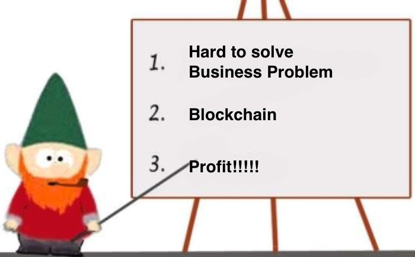

When reading blockchain marketing material one could get the impression blockchain is the solution for everything. And if my experience in tech ever taught me anything it's that "silver bullets are a myth".

But let's take a closer look at the problems that blockchains are supposed to solve. Surprisingly all these problems have one thing in common:

**They are really hard to solve**

More specifically a large chunk of "real world blockchain applications" is tackling the issue of "there is lots of paper and that makes things slow" or how they would say it "efficiency improvements".

The logistics industry is usually used as a poster child of that problem. There are lots of different entities involved when shipping goods, the longer the trip, the more people involved, the more paperwork. **Yes, this is an issue and it has been an issue for a while. But did anyone ever ask why we haven't solved it until now?** It's not like large logistics companies don't know about computers and don't have smart people.

Well obviously they don't know about blockchain, because as soon as you put everything on a blockchain all of these issues will magically go away.

I realize how snarky that sounds. But this is exactly the narrative I read over and over again.

Articles like [19 Industries The Blockchain Will Disrupt](https://futurethinkers.org/industries-blockchain-disrupt/) (one of the top Google results when you type "blockchain industry disruption") are basically just saying that. Let's look at our supply chain example:

> With blockchain technology, transactions can be documented in a permanent decentralized record, and monitored securely and transparently. This can greatly reduce time delays and human mistakes.

Oh really? Please explain how. Just because you say some solution achieves something does things doesn't make it true.

As soon as you start asking more detailed question like:

- What exactly is stored on the blockchain?

- Who defines the standard on how to write information on the blockchain?

- Who is allowed to write on the blockchain?

you'll usually get vague answers that prompt more questions.

All of this article is just a long way of saying:

**Maybe these problem are hard for non-technical reasons**

But prove me wrong. How many successful blockchain supply chain companies are there and what market share do they have? I wrote a [similar article](/blog/2018/04/03/blockchain-is-merely-a-marketing-instrument/) 3 years ago and I am still waiting for proper examples.
