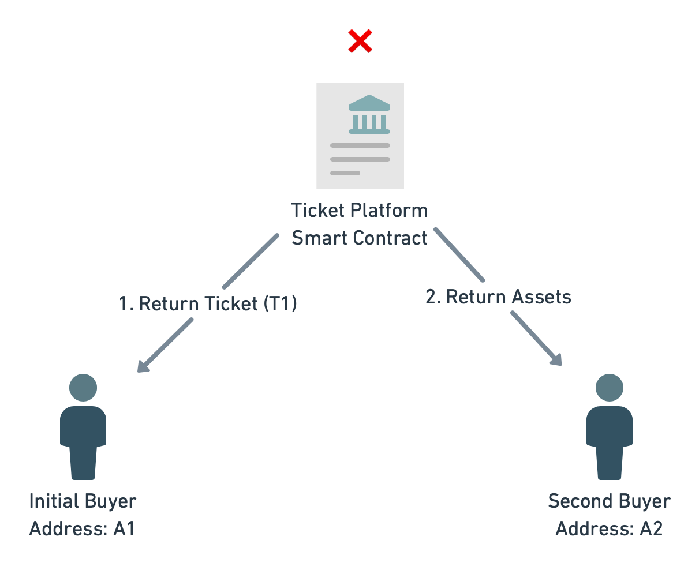


And Possibly Make It Worse


When reading about blockchain I am often astonished about the number of problems blockchain technology is supposed to solve. I admit I am very quick to dismiss any of the claims that these startups are making. But from time to time I hear about a use case that takes me a little while to think through.

This happened to me recently when I stumbled upon an [interview podcast episode](https://alphalist.podigee.io/24-peter-grosskopf) with Peter Grosskopf where he gave an intro to blockchain and brought up a couple examples. Disclaimer here: I owe a great deal of my career to Peter as he was the first one to hire me as a tech freelancer back in 2016. I have nothing but good things to say about him, I just happen to disagree with him about his assessment about the blockchain.

In the episode there is a brief mention of trying to solve the problem of ticket price gouging through blockchain technology. The problem goes like this: The economy of event tickets puts us in a dilemma. The supply is limited but the demand is high (especially for popular artists). But the artists usually don't want to implement the obvious solution: raising the prices to match up supply and the demand. But by refusing to do so, we give the opportunity to unrelated parties to make a profit off ticket prices without contributing to the artist. [Freakonomics](https://freakonomics.com/podcast/live-event-ticket-market-screwed/) had a great podcast episode about this (yes, I do like podcasts).

So you can't charge insane prices for tickets but you also want to prevent other people from charging insane prices. If the demand is high enough that seems to be an unsolvable problem. There are some half baked solution such as personalizing tickets. But then there are side effects to these implementations. But fear not, there is a blockchain solution.

If I understand the pitch correctly it would work a little bit like this: ownership is tied to a token on the blockchain. As long as you have the private key to that token you are the rightful owner of the ticket. When you enter the venue your token would be invalidated to prevent double spending (or duplicating the private key and therefore giving more than one person access to the event). You would run into similar issues with ownership as outlined in my [last article](/blog/2021/05/16/real-world-ownership-is-not-a-use-case-for-blockchain/) but I think for this narrow use case it could actually work. As this is a token on the blockchain you could transfer it any time before it is invalidated (event is attended). And because you can build a payment network on the blockchain you could also combine the transfer with a cryptocurrency payment.

Here is where the advantage would come in. Through a smart contract you could enforce the selling price. Let's say a ticket is $50. It is possible to enforce this price on a technical level. You can even implement variations where you enforce $50 as a maximum (allow cheaper ticket sales) or give a little bit of an incentive by allowing a price increase up to 10%. The details are not important but yes on a technical level you can restrict resale of the technical token.

So the setup would look like this. In this scenario, the smart contract would have the condition to check that the funds transferred are $50 or less.

If for some reason Second buyer wires more than $50 for the ticket, the transaction is reversed.

So far the pitch. There are nuances to the implementation but the end result is the same. It is impossible to pay more than $50 for a ticket on a technical level. Can you spot the problem? It took me a little bit but I would like to ask anyone who thinks this is viable the solution the following question:

What stops me from making a craigslist ad that says the following:

> Hello there!
>
> I have 2 tickets to <insert popular artist>. The box office price is $50 each. If you wire $1000 to my bank account, I'll transfer ownership to you on the blockchain.
>
> Price non-negotiable

Assuming the demand is high enough, I'll find someone who is willing to pay this insane price. At this point you as the buyer or the blockchain startup have gained absolutely nothing. You still have price gouging that is happening outside of your blockchain universe. You implemented a complicated technical solution that doesn't solve the problem.

But I can do you one better. I will make the argument that you can actually make the problem worse with a blockchain solution.

Because the obvious problem with the craigslist ad is people tend to mistrust "some dude on the internet". After all, they could just not transfer the ticket (or not even own the ticket). To "solve" this I present to you a blockchain solution that would get around this trust issue.

First of all, if the ticket token is tied to a public address and can be verified to be an actual token to the right event, it is trivial for the ticket owner to proof that they actually have the ability to transfer the ticket (sign an arbitrary text message with their private key). So I as the price gouger am 100% able to proof that I am able to transfer the ticket to you. But that doesn't mean I'm actually gonna do it.

This is the part where blockchain comes in pretty handy.

Because it is possible with smart contracts to assign conditions of any payment with code, I can make the ownership transfer a condition for payment.

In this scenario I would not be the price gouger but a developer implementing a smart contract that will confirm ownership of a token to an arbitrary address:

I chose the addresses B1 and B2 because the payment will happen outside of the original ticket platform (it might be on the same blockchain though). The buyer will transfer assets to the seller. In this case there is no limit on the asset and as the smart contract doesn't do any checks on the amount, this is perfectly valid. In addition to the amount the buyer will submit two pieces of metadata. The desired destination address on the ticket platform (A2) and a reference to the desired ticket (T1). In reality there would probably also be a timeout on the smart contract, that would reverse the transaction if the ticket is not transferred within a certain time window.

This way price gougers can leverage the zero trust advantage that blockchain enthusiasts so often rave about. You could even implement more nefarious solutions that combines all of this with an auction to guarantee the highest price possible for the price gouger. Apart from overpaying for the ticket this system also gives a benefit to the buyer. If they trust the smart contract, they can be sure to receive a non fake ticket. After all, buying fake tickets is also a problem in the secondary market of

So again, you have gained nothing. In addition you even gave price gougers the opportunity to actually verify that they have a real ticket, so they can technically proof that they own a rightfully issued ticket and not some counterfeit product. In addition to that, you allowed for another secondary market to exist that has no moral justification to be there. And you can be sure that this bogus escrow will take a transaction fee off the ticket sale.

I would love to be wrong on this. After all I think price gouging is a problem worth solving.

*Attribution: [Ticket Coupon Admission](https://pixabay.com/photos/ticket-coupon-admission-carnival-2974645/) by [igorovsyannykov](https://pixabay.com/users/igorovsyannykov-6222956/)*
