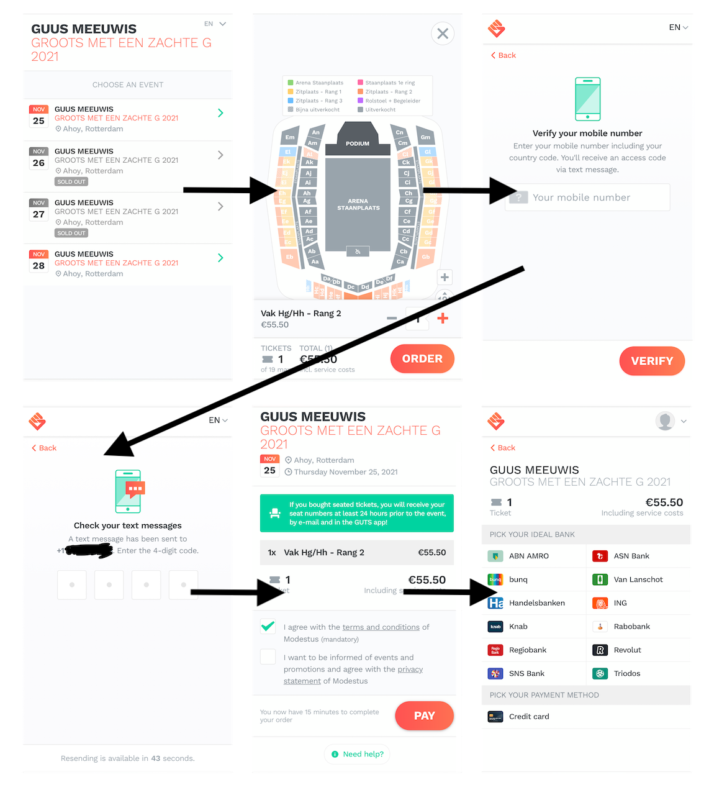
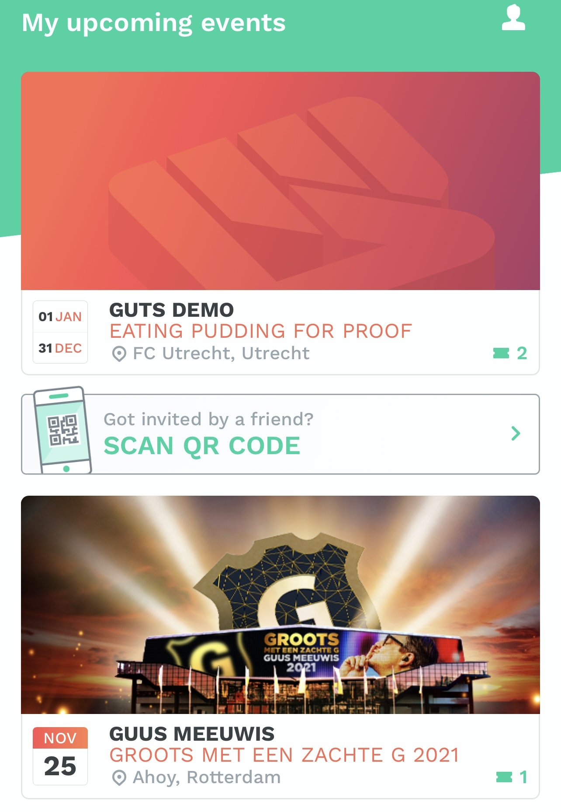
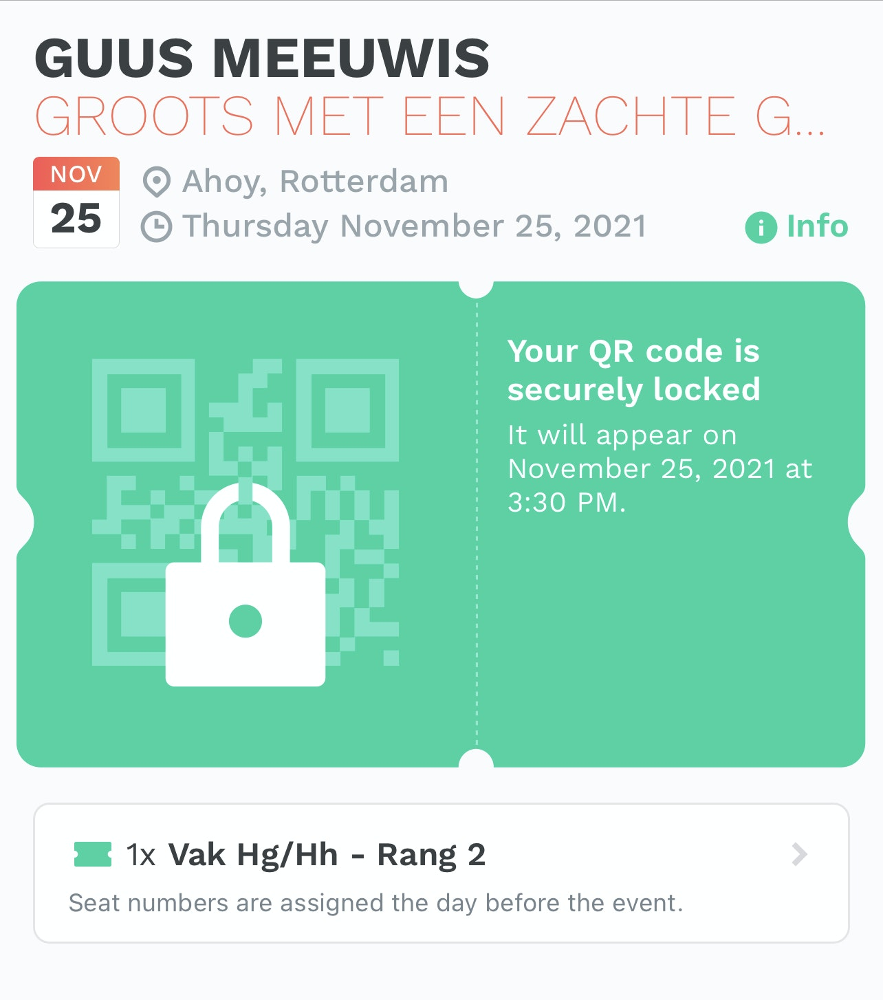
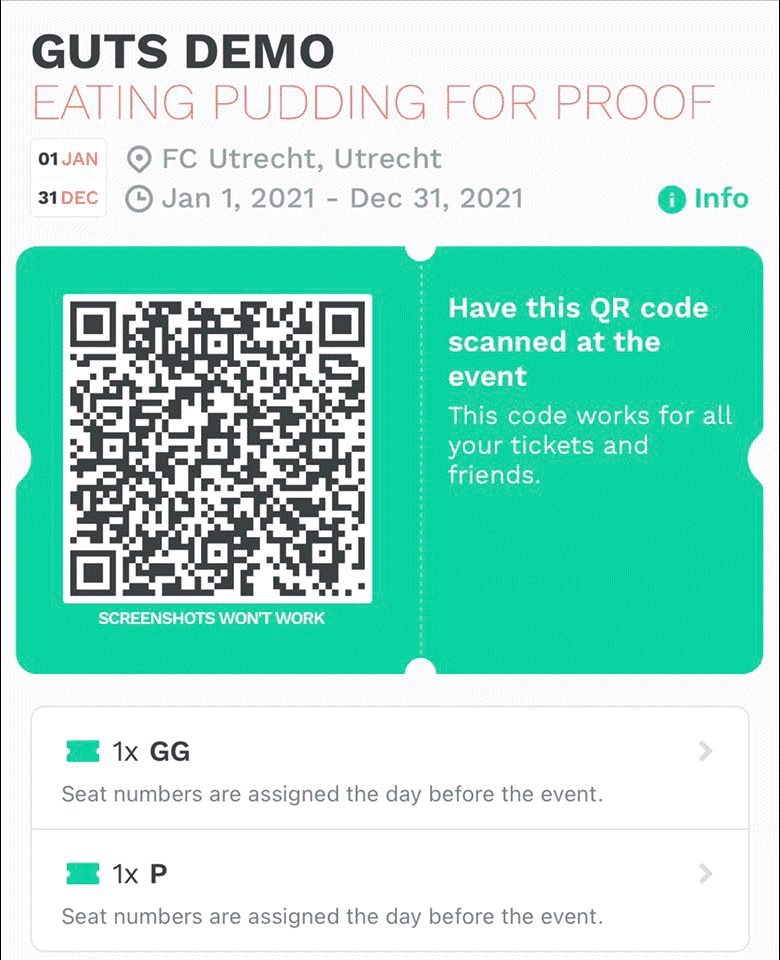
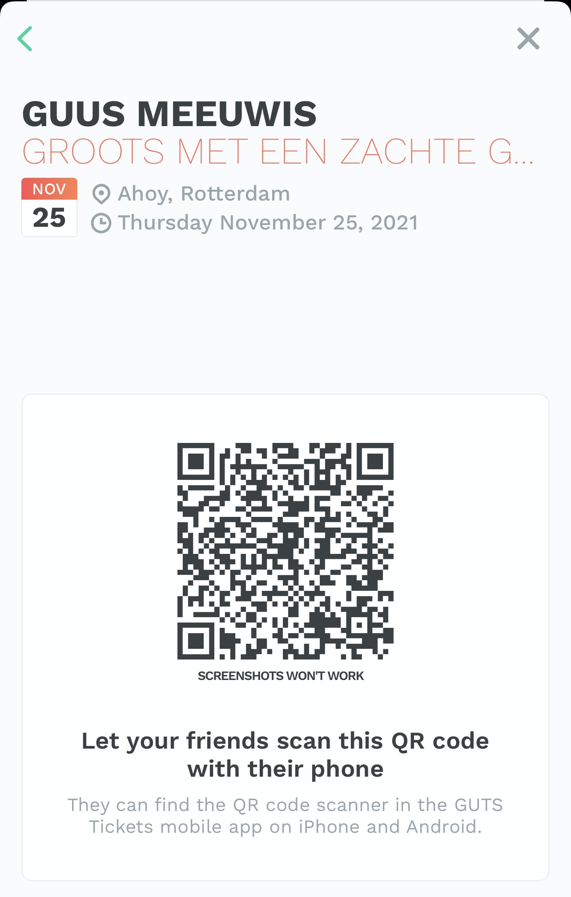


It's Solved Through Centralization and Proprietary APIs


*TL;DR: The reason why ticket scalping is a non issue through GET is because there is effectively one entity that controls the ticketing process*

I got a couple of responses on my last article about price gouging/ticket scalping. One solution was mentioned that supposedly does solve this issue through blockchain.

Before I respond to these claims I feel the need to clarify something about my last article. There are a couple of passages in there that make it seem as if ticket scalping is an unsolvable problem or that it needs to be solved 100% to be effective.

Neither is the case. With the right trade off, this should be a solvable issue. Let me give you an example.

For the sale of tickets it would be trivial to make event tickets like refundable airline tickets:

- You give your name your birthdate and maybe some more details to the ticket vendor
- You get a machine readable code that encodes a ticket id. The most commonly used ones are QR codes.
- On entry to the event the QR code is scanned (either from a piece of paper or your phone), and you will have to show some form of ID to prove that you are the rightful owner of the ticket
- The event organizer verifies that the scanned ticket ID was bought under the name on the ID
- In addition you can return the ticket any time before the event starts (or a specified amount of time into the event, assuming you haven't entered yet)

This pretty much solves ticket scalping. It's very hard to sell a ticket that is under your name. The only way that would work if you find a buyer with your exact name and birth date or a buyer that is willing to enter an event with a forged ID.

However, this comes with a couple of downsides (trade offs):

- It's harder to buy tickets as a gift, assuming the buyer is not attending
- It's harder to have tickets as a prize of a raffle (especially popular for sold out concerts)
- It's harder to just give the ticket to a friend in case you have to cancel last minute
- It takes significantly longer on entry because you'd have to show ID and you potentially have annoyed customers who forgot their ID etc ...

I can think of various solutions to solve the first two points. On ticket purchase you could provide the details of the friend and mark the tickets as a gift so that the friend wouldn't be accidentally notified about the concert. Additionally you could allow to purchase more than one ticket as long as everyone in your party is with you on entry. Only the buyer would have to show ID and the buyer has to attend (AFAIK this is how Hamilton ticket sales on Broadway work). Small chance of ticket scalping here, because I could just buy 2 tickets, sell one ticket for a higher price and just price the original ticket into my selling price. This doesn't really scale though because I would have to live in the city of the event or at least be willing to travel there.

You could also have a system for coupon codes that work even if the concert is sold out. You could provide these coupon codes to authorized radio stations or whoever holds a raffle for concert tickets. Again you'd introduce a small risk of ticket scalping, because there could be corrupt radio stations etc... Assuming the amount of tickets that will be raffled off is very low, this doesn't really matter.

The last two points are a little harder to solve. Being able to just give a ticket to a friend introduces a massive risk of a secondary market outside the ticketing system.

But have you noticed? None of this is very blockchainy. Which brings me to the GET protocol. Because their claim is that they solve this same issue with fewer side effects. Essentially solving all four problems.

## Introducing the GET Protocol

Multiple people pointed out, that the GET (Guaranteed Entrance Token) Protocol is a way to solve ticket scalping using blockchain technology. They brand it as "honest ticketing". So I was curious and started digging.

For my research I read the [GET protocol whitepaper](https://get-protocol.gitbook.io/whitepaper/), inspected all of the existing ticket apps I could get my hands on, played around with the [demo ticket](https://guts.events/u5fcf3-eating-pudding-for-proof/pkdcbk), actually bought two event tickets and reached out to GET protocol directly on Twitter and Telegram for clarifications.

Evaluating the claims about ticket scalping based on GET protocol turned out harder than I thought. First of all the [GET protocol whitepaper](https://get-protocol.gitbook.io/whitepaper/) is (by their own admission) an outdated document. And in general it is pretty hard to verify if any concept works by a conceptual document alone.

Luckily there is one implementation of the GET protocol that is live in production. The Dutch company GUTS Tickets is providing a ticket service and is successfully selling tickets.

I want to mention at this point that I am not convinced that there is a clear separation between the GET Protocol Foundation and the private company GUTS Tickets. Both entities are registered at the same office address, with the same CEO and have a significant overlap of employees. I asked the GET Protocol foundation for a statement regarding conflict of interest and their response was that long term the GET Protocol will become a [DAO (Decentralized Autonomous Organization)](https://en.wikipedia.org/wiki/Decentralized_autonomous_organization) and will be governed by a the community (aka token holders). You can already see first steps as GUTS Tickets is currently hiring a [CEO](https://guts.recruitee.com/o/y6varsskms). But as of early July 2021 there is still a lot of overlap and only time can tell if the GET protocol will become truly independent of GUTS Tickets.

I will therefore only evaluate the initial claim of "solving ticket scalping through blockchain" on the existing implementation of the GUTS Ticket product.

## Evaluating GUTS Tickets

The Dutch company GUTS Tickets provides several solutions for event organizers and attendees. Most notably is their mobile app ([iOS](https://apps.apple.com/us/app/guts-tickets/id1366257468)/[Android](https://play.google.com/store/apps/details?id=com.gutstickets.wallet&hl=en_US&gl=US)).

How it works is rather simple. When you are buying a ticket you are guided through a regular ticket buying process. You can select a day and your seat, see the price of the tickets and can checkout. For this example I actually bought a ticket to a concert of Dutch Singer/Songwriter [Guus Meeuwis](https://grootsmeteenzachteg.nl/).

Before you can checkout your ticket you will need to provide a phone number and enter the confirmation code that is texted to you. After that you are prompted with a payment screen to pay for the tickets.

After this you can download the app, enter your phone number and you will see all the tickets you ever bought through GUTS' ticketing service.

You can try out this flow yourself with their demo tickets which works the exact same way except for skipping the payment process.

This is a QR code based solution and not that different from my proposed solution in the intro but there are a couple of twists that make it far superior.

### 1. The QR Code Is Not Visible until Day of the Event

The QR that will be scanned on entry to the event will only show up a couple of hours before the event starts. This feature will give ticket scalpers only a narrow time window to actually transfer the tickets and therefore not only increase their effort but also decrease the trust for potential buyers. If you bought a ticket for a high price you would also have to trust the seller that they will be available 3 hours before entry to actually transfer the ticket to you.

### 2. Rotating QR Code

Even when the QR code appears it is not a static code. The QR code changes every 10-15 seconds. This is a genius idea and a great example how technology can truly improve the process. Assuming the tech behind the rotating QR code is solid, it is near impossible to forge a ticket.

### 3. Possibility to Sell Tickets in App

The two previous features solve the ticket scalping to a sufficient level and in addition no identification is needed, completely eradicating the need to check a photo ID on entry. Even though GUTS asks for an email address and some other personal data, it would be possible to have an implementation  without any identifying features. All you need is access to your initial phone number. And there is no need to verify IDs on entry because having the rotating QR code is proof enough that you bought the ticket through regular channels.

But the advantages of the app go even further. Assuming the organizer allows for it, it is possible to sell tickets in app (for the original price). In addition you are also able to transfer a ticket to a friend given that you are in the same place. The way it works you get a dedicated share dialogue (again with a rotating QR code) and your friend would scan the code with their app. Additionally the app checks your current location to make coordination over video call harder.

This is a potential for ticket scalping as you could always meet someone in front of the venue but I think GUTS made the right tradeoff here.

## So What's Your Point?

Seems like GUTS achieved what they claim. Honest ticketing through blockchain. Right?

Well, yes and no. It's true their implementation is a solid solution against ticket scalping. And I mean this non-ironically when I say, I love the product. I can imagine this becoming a mainstream solution for tickets of any kind. The only downside I see is that if someone for whatever reason doesn't have a smartphone on entry, they won't be able to get in. But this again is a question of trade offs. I think we live in a time where it is reasonable to expect every concert goer to own a smartphone. And even if you wanted to make smartphone ownership optional you could still fall back on a static QR code with ID option. You'll have to wait longer but you would still be able to attend.

But here is where I struggle to give them credit. Not only is all of this possible without any blockchain, as far as I can tell the ticket buying and ticket redemption process uses zero blockchain technology. I can't look into their backend and see when and what they write to what blockchain, but the main part that solves the ticket scalping has absolutely nothing to do with blockchain.

The rotating QR still works without internet (which is good) so it is fair to assume that no reading or writing to the blockchain is necessary for it to work. Even the payment process works through regular banking processes (I was able to buy a ticket with a credit card) so even the payment has nothing to do with blockchain.

According to GET/GUTS every ticket is an [NFT](https://en.wikipedia.org/wiki/Non-fungible_token) on a blockchain. Which for me raised the question of where the private key that grants access to the NFT is stored. I conducted multiple tests and as long as you can receive text messages on your registered phone number you can have tickets on multiple devices (tried on my main phone, a phone without a SIM and a phone that has a different phone number). I also reached out to the GET Protocol foundation for clarification. At the writing of this article I have not received an answers despite following up multiple times.

This means that even if the ticket is an NFT, the private key that is necessary to sell it, is managed on a server that GUTS controls. This kind of implementation comes with a dilemma that cryptocurrency enthusiasts describe as "not your keys, not your coins", or in this case "not your key, not your ticket". You can either be the sole owner of the private key to your assets and be responsible for your loss. Or you can have a third party manage your private key but then have to trust this third party with your asset. From the research that I did the GUTS ticketing solution is the latter. So when you buy tickets through GUTS you will have to trust a private company that they will not sell/invalidate/lose your tickets.

To sum this up, there are multiple reasons why ticket scalping (and fraud for that matter) is a negligible issue on GUTS ticketing platform.

### 1. Single App Solution

There is one GUTS ticket app which you will need to redeem tickets. There are white label solutions in other countries but from all the research I could do, these white label apps interact with GUTS Ticket servers and only work with specific events. There is no truly independent third party integration so you will have to get the app through an authorized App Store. I asked the foundation to clarify if third party implementations were possible at all but did not receive a reply.

As one private company controls the whole user experience of the ticketing process this is a classic example of centralization.

### 2. Phone Number Authentication

The only way to see your ticket is to log in using a phone number and verification code via SMS. This makes it very hard to sell off a whole account because phone numbers are very hard to create and to transfer. If there was an login mechanism via email and password, ticket scalper could just create accounts for every ticket purchase and sell username and password. So going with a phone number only login, definitely helps here.

### 3. Smart QR Code Implementation

As explained before the smart QR code is a very good implementation. I tried to get a better idea of how the rotating works exactly but here as well GET protocol foundation was not able to provide me with implementation details. I will give them the benefit of the doubt and assume the tech is solid. I can only guess that the rotating QR code is implemented with some kind of private key that signs a timestamp and a ticket ID and is verified by its public key counter part on entry. So it would theoretically be possible to extract the private key and reverse engineer the rotating code. I think that is not a very realistic attack vector though and is again a good trade off.

### Bottom Line: No Blockchain Here

None of these things have anything to do with blockchain. So I think it is fair to say: **blockchain contributes in no way to GUTS' honest ticketing solution.**

## Responding to Possible Comments

I really want this to be the last article about blockchain/NFT ticketing (at least until Mark Cuban announces his [NFT ticketing service](https://www.cnbc.com/2021/03/26/mark-cuban-dallas-mavericks-may-use-nfts-for-ticketing.html)). But I am anticipating a couple of counter points, so I wanted to pre emotively respond to those.

### It's Not about Honest Ticketing! It's about Transparency, Pre Financing of Concerts Etc...

It's true the GET Protocol promises more advantages than just honest ticketing. Their CEO even posted a comment on the initial article that goes in the same direction.

My response to this:

As of early July 2021, the GUTS website puts the following on the very top of their website:

> GUTS uses blockchain technology to issue honest tickets that put an end to disgraceful secondary market prices and ticket fraud.

The GET protocol page is a little bit more nuanced with the statement:

> The GET Protocol offers a blockchain-based smart ticketing solution that can be used by everybody who needs to issue tickets(NFTs) in an honest and transparent way.

So I think it's fair to say that honest ticketing is their main selling point. And I don't see any other way to read this as "We achieve honest ticketing **because of blockchain**".

This article is already long enough and I specifically chose to limit the scope to honest ticketing because it is intended as a response to my previous article. And the previous article was specifically about the problem of ticket scalping.

### This Will All Be Solved in the Future with X

Or in other words: "just wait, these things need time. Maybe sooner or later they replace these proprietary elements with something that is truly in the spirit of blockchain."

I am going to dedicate a whole article about the argument that blockchain has "potential" or it "could revolutionize" something. But for now I'm gonna stick with "show don't tell".

GET is currently making claims and they are not true. This is all I'm saying. If at a future point something will replace the current ticketing solution, I'm happy to have a look again.

## Conclusion

If anyone at GUTS Tickets/GET Protocol reads this article, here is my appeal to you: **Drop the blockchain**.

What you currently have is a great solution to the ticket scalping problem. I do like your app and building on that foundation is very promising. I like the UI, I like the fact that you have white-label partner, I can see that you have a proper [API documentation](https://docs.guts.tickets/). I wish you all the best for the future.

I believe that you are writing something to the blockchain at some point. With the recent release of the [ticket explorer](https://explorer.get-protocol.io/) this can actually be verified. Last year, you wrote a [lengthy tech article](https://medium.com/get-protocol/the-desert-of-the-real-introducing-getnft-tickets-99a14e0b6951) claiming that your NFT integration is more than just window dressing.

I'm not convinced. Your main claim about honest ticket through blockchain is simply not true. Your product (from a concert goer perspective) would work the exact same way if you stored ticket data in a database.

I find that very unfortunate especially for a community that prides itself so much with trust and transparency.

*Image by [Gerd Altmann](https://pixabay.com/users/geralt-9301/) from [Pixabay](https://pixabay.com/illustrations/network-rectangle-rings-networking-1989146/)*
