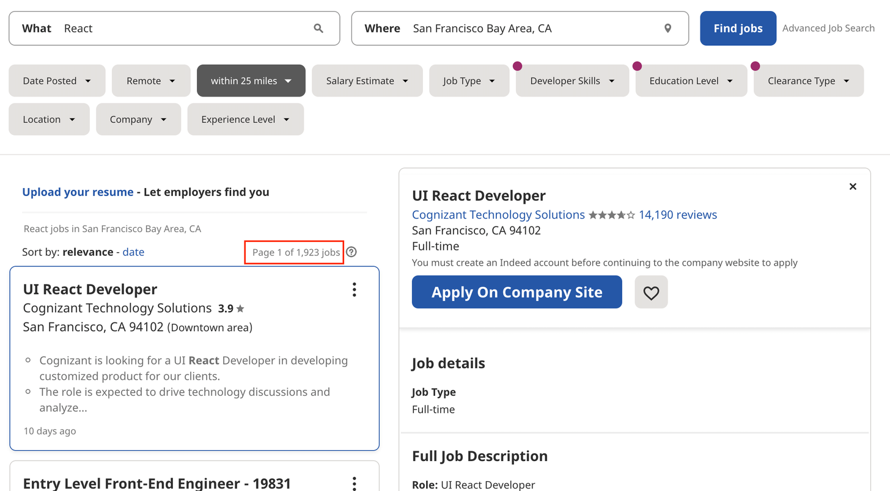
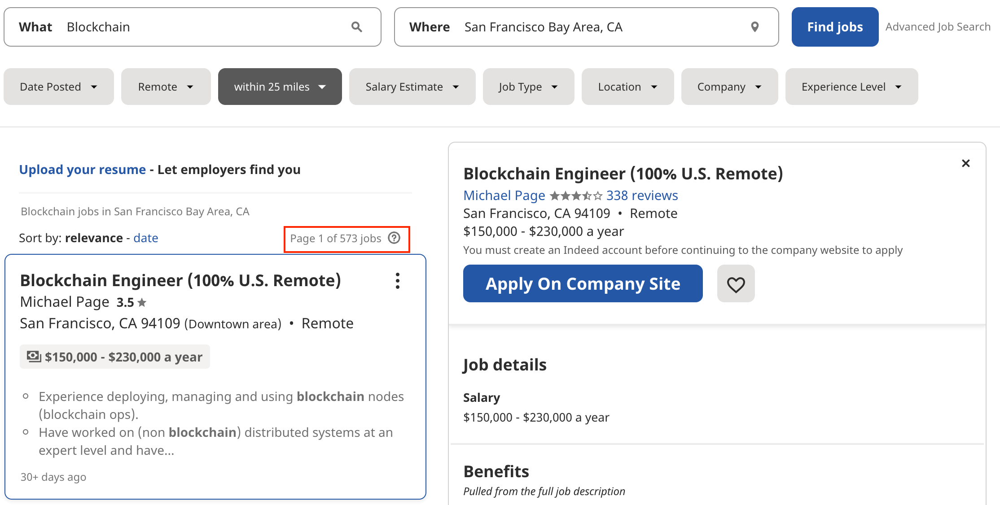
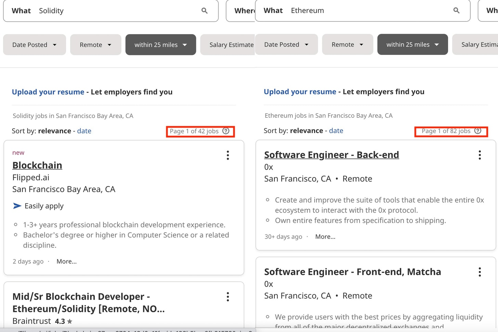


And the Absurdity of the "Argument on Potential"


I listened to - and participated in quite a lot of blockchain related debates. By now I can pretty accurately predict how these debates end. The way this usually goes is that someone makes a completely unsubstantiated claim about what blockchain will or possibly can disrupt, sometimes even ["is already disrupting"](https://i.redd.it/f22p18ddu2371.jpg). When you follow up and ask "well, what has it disrupted?" the answer is either some cryptocurrency related project (decentralized exchanges, lending products) or another unsubstantiated claim or flawed analogy. Ultimately, the more you drill down you will end up at the argument of "we are just at the beginning, these things take time". For a good example of this, I recommend [Episode 2 of the Blockchain Debate Podcast](https://blockdebate.buzzsprout.com/767033/2506837-motion-tokenization-and-smart-contracts-are-useful-ideas-emin-gun-sirer-vs-edmund-schuster) where this progression is played out perfectly.

But let's tackle the "blockchain will disrupt industry X" argument. For short I will call it the "argument on potential".

In general anything has the potential to disrupt any industry. But unfortunately you can't immediately proof or disproof this claim. So you will need to wait a little bit to even start your evaluation. This gives the claimant the upper hand because at any point in time they will be able to say "we are not there yet, just wait a little longer". But we already have been on board of the "blockchain will disrupt industry X" train for a while now so I think it's a good time to see if we are arriving at the station anytime soon.

## Let's Talk Timelines

*Note: All timelines will be calculated against December of 2021.*

Let's first look at how long blockchains have been around. The underlying theories of blockchains are commonly referred to as [Merkle trees](https://en.wikipedia.org/wiki/Merkle_tree) which were patented in 1979. That is a pretty unfair starting point to judge because for various reasons the path from algorithms to actual applications can truly take decades.

So let's look at the implementations. The most prominent implementation of a blockchain is the Bitcoin Network. The first block on this blockchain was mined on [January 3, 2009](https://www.blockchain.com/btc/block/000000000019d6689c085ae165831e934ff763ae46a2a6c172b3f1b60a8ce26f), almost 13 years ago. Granted at this point Bitcoin was mostly known among subscribers of the [Cypherpunks Mailing List](https://cryptoanarchy.wiki/getting-started/what-is-the-cypherpunks-mailing-list). It gained more mainstream attention in 2011 when it hit the front page of [slashdot](https://news.slashdot.org/story/11/03/23/0210207/Google-Engineer-Releases-Open-Source-Bitcoin-Client) (this is the time I first heard of Bitcoin). What followed was a wave of ups and downs, reflected in the Bitcoin price. 2013 was the first time I heard people talking about uses cases for blockchains beyond cryptocurrency and indeed the same year Ethereum, the most prominent blockchain for decentralized application development, was announced. In July of 2015 it was initially released and around the same time the first basic applications such as "notary services" were implemented on the [Bitcoin blockchain](https://www.ccn.com/crypto-public-notary-uses-bitcoin-block-chain-notarize-digital-content/).

So to make a long story short, **the shortest timeline for blockchains being used for non-cryptocurrency uses cases I'll accept is 6 years**. And I think it's fair to say: up to now nothing substantial has come out of the business blockchain universe (NFT enthusiasts keep reading I'll get to you later). Hence the argument on potential which we are still dealing with in 2021.

But how do we know that 6 years is an appropriate time to wait? I want to take the opportunity to compare it to something that is arguably one of the most disrupting inventions of the recent time.

## The Smartphone

I hope I don't have to make the argument that the smartphone is one of the most defining and influential inventions of this century. Even though we had cellphones, mobile internet and touchscreens before, the smartphone brought a completely new way to use the internet to our society.

The beginning of the smartphone is very easy to pin down. The release of the original iPhone on June 29th 2007.

So fast forward 6 years from that: according to the Pew Research Center the smartphone ownership of US adults in 2013 was [over 50%](https://www.pewresearch.org/internet/2013/06/05/smartphone-ownership-2013/). I don't think we have that kind of adoption of blockchain (especially if you leave out cryptocurrencies).

But I think an even better example is Uber, undoubtedly a company that would not be possible without a smartphone. They were founded in 2009 and in August 2013 they were already operating in [40 US cities](https://web.archive.org/web/20130814020221/https://www.uber.com/cities), shortly thereafter [expanding internationally](https://web.archive.org/web/20130921054323/https://www.uber.com/cities). You can think of Uber what you want but you can't deny that the existence of ride sharing services had a tremendous impact on our society and existing industries.

So if you want to talk about disruption, I would expect a similar timeline as the smartphone or companies like Uber.

## But It's Like The Internet in 2000

I can't really talk for all blockchain enthusiasts but I never heard anyone compare a blockchain to a smartphone. Instead it is usually compared to the Internet. And with the internet the timeline is a little bit harder to determine:

- 1959: The [first commercial modems](https://en.wikipedia.org/wiki/Modem#1950s) were available
- 1969: The [ARPANET](https://en.wikipedia.org/wiki/ARPANET) - usually seen as the "first" internet - was established
- 1982: TCP/IP was [adopted](https://en.wikipedia.org/wiki/ARPANET#Adoption_of_TCP/IP) by ARPANET
- 1991: The WWW went public
- 1993: AOL [began mailing out their Floppy Disks](https://americanhistory.si.edu/collections/search/object/nmah_1395721) and subsequently CDs (#only90skidsremember)
- 1999: The [first Wi-Fi enabled Laptops](https://en.wikipedia.org/wiki/Wi-Fi#History) were available
- 2003: [MySpace launched](https://en.wikipedia.org/wiki/Myspace)
- 2006: [Twitter launched](https://en.wikipedia.org/wiki/Twitter)

After this I remember the first debates about the downsides of the internet and politicians were unable to ignore that the internet is a thing. Granted the points I picked are somehow arbitrary (AOL developed independently of the WWW, MySpace was not the first social media network and there are probably other milestones). But it's clear that it has been a pretty long process so the argument of "it takes time" fits the timeline of the internet pretty well.

And indeed I have seen [people claiming numbers](https://news.ycombinator.com/item?id=27338957) as high as "32 years" for disruption to happen.

However the argument I heard the most often is comparing the status quo to the internet of the 2000s (sometimes the late 1990s). Let's ignore for a minute that this time period included a [giant crash](https://en.wikipedia.org/wiki/Dot-com_bubble) and look at the merit of this statement.

Born in 1985, I've been alive for a significant portion of the rise of the internet (dot com boom). I grew up in a rural area of southern Germany and by no means had access to university provided internet. I was lucky that my parents had a 56k dial up connection and using the internet was essentially a phone call which blocked the line and you had to pay for by the minute.

I started using the internet in 1998, mainly in forums to chat about video games. Granted I was an early adopter but I was by no means the only one in my circle of friends that used the internet. In fact I frequently sent emails and and [ICQ messages](https://en.wikipedia.org/wiki/ICQ) to friends of my high school. In fact when I visited the US for a while in 2000 I was able to stay in contact with my friends back home on a regular basis via email. A couple of years later our school year had a our own [IRC server](https://en.wikipedia.org/wiki/Internet_Relay_Chat) where some of my classmates and myself would spend significant time.

In addition to my little anecdote the PEW research centers states the [internet usage in 2000 at around 52%](https://www.pewresearch.org/internet/2015/06/26/americans-internet-access-2000-2015/). So this is what blockchains enthusiasts compare the usage of blockchain to right now. In their little bubble maybe "everyone is working with or on blockchain applications" but in the real world ledger technology is basically irrelevant.

Just for some perspective: I work as a software engineer a profession that is present in most companies beyond 50 employees. If blockchain was truly in high growth mode as it is so often claimed I would get a lot more recruiters approaching me about blockchain. But hey, maybe I'm biased because I don't have any credentials in that field. That usually doesn't stop recruiters to send me job postings but maybe it really is different in the blockchain world.

So I conducted an experiment on indeed and looked for various job postings in the Bay Area using [indeed.com](https://www.indeed.com). As a baseline I started with React, a framework that is used by all companies I worked for in the last 5 years in one way or another. At the time of writing there are currently over 1900 pages of job offers (page size of 15).

Compare that to the search term Blockchain and the results are significantly lower. A total of 573 pages of job postings.

Honestly that is more than I would have expected but these postings include Jobs like "Financial Analyst" or "Business Development Associate" and various engineering jobs that list blockchain as a "be interested in" requirement.

If you drill down further and look for concrete blockchain technologies like Ethereum or Solidity the search result reduce even more. 82 and 42 pages respectively...

That's about 6.5% of the job openings for React developers. And that's only one technology. For a technology that has been around for 6 years I just don't see this great demand.

But there is a new shining star on the Blockchain horizon and maybe this is the future.

## Fine, Let's Talk about NFTs

NFTs are all the rage and the promise is, it will revolutionize art as we know it, redefine ownership and give artists more control over their works. As I stated in [my mission](/schlockchain), my blog is not concerned with cryptocurrencies and I have a hard time separating NFTs from cryptocurrencies entirely just because of their speculative nature but I'm willing to include them in this article.

My main argument here is that NFTs are not new at all. The earliest reference I found digitizing and tokenizing assets is something called "Colored Bitcoins" that goes back to [August of 2014](https://en.bitcoin.it/w/index.php?title=Colored_Coins&oldid=49384).

NFTs mostly seem to be a newish standard that is called [ERC-721 Token](https://ethereum.org/en/developers/docs/standards/tokens/erc-721/) which describes a formal way of tokenizing and transferring assets. This standard was defined in the beginning of 2018 and therefore making the argument on potential a little bit more solid (4 years instead of 6 years).

I would still stand my ground and say, the concept is not new at all. In fact the whole blockchain universe was continuously trying to sell the idea of trustless, decentralized, democratized ownership since the very beginning. Trying to apply the concept of cryptocurrencies to anything asset is what it's been about from the inception of Ethereum.

If there was some killer use case for artists we would have seen much wider adoption by now.

To me the whole NFT space just look like a rebrand to create the illusion of something new. Let's see if [Crypto Synths](https://academy.shrimpy.io/post/what-are-crypto-synths-synthetic-assets-explained) will be peddled as the supposedly new technology that will redefine ownership.
## Conclusion

I've been hearing the "just wait" and "it's just the beginning" for years now. In fact my first blockchain article dates back to [March 2018](/blog/2018/04/03/blockchain-is-merely-a-marketing-instrument/) and all I heard as a response was the argument on potential. Wired published an [article in May](https://www.wired.com/story/187-things-the-blockchain-is-supposed-to-fix/) the same year about all the industries blockchains are supposed to disrupt. The provided links in the article are mostly going to nowhere or the companies pivoted away.

So instead of talking about a potential future, I really would like to see hard proof of how blockchain actually does disrupt your industry.

*Attribution: [Running Late for Work](https://unsplash.com/photos/sf6tMkg84-U) by [Christopher Luther](https://unsplash.com/@chriscantlose)*
