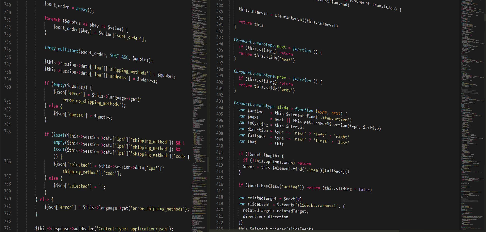

One element of writing my last [wordle article](/blog/2022/01/09/building-a-wordle-solver-with-regex-and-elixir) was creating screenshots to illustrate the solving algorithm. But I didn't want to use the word of that day (which was "gorge"), I wanted to use a specific word ("tiger" fom Jan 5).

This is where my digging into the workings behind wordle started. I was curious how the word of the day is chosen. I noticed that the new word is always available at midnight of "your" timezone so I suspected that all of the logic is implemented in the frontend (no secrets that are fetched from a server).

Formatting the minified frontend code drew my attention to this line:

```javascript
e.today = new Date; // <---- Seed for the solution (Today's date)
return Na(
      ...
      e.boardState = new Array(6).fill(""),
      e.evaluations = new Array(6).fill(null),
      e.solution = Da(e.today),  // <---- Setting the actual solution
      e.dayOffset = Ga(e.today),
      e.lastCompletedTs = o.lastCompletedTs,
      e.hardMode = o.hardMode,
      ....
```

So it seems like the solution is calculated as a modulo of the current date.

Not only does that provide an easy way to cheat (type `$("game-app").solution"` in your browser console if you really want to do that), it also shows a way on how to get a different solution word.

In theory, all you need to do is to set `#("game-app").solution` to something different. That's great if you want to create screenshots for a specific word, but if you actually want to play the solution for a different day you would somehow have to manipulate the value of `#("game-app").today` before it is actually used to calculate the target word.

The easiest solution I came up with is manipulating the source code because it is evaluated. Weirdly enough this was way easier to do in Safari than it is in Chrome. So the following tutorial will work for the Desktop version of Safari.

So in order to get a different word you will need to get your hands dirty in the [Developer Console](https://support.apple.com/guide/safari/use-the-developer-tools-in-the-develop-menu-sfri20948/mac).

## 1. Reset the Current Game State

If you already played a game you need to remove the game state from the local storage:

- Navigate to "Storage" in the Developer Console
- Select Local Storage
- Delete the entry for `gameState`





## 2. Create a Local Override for the Wordle JavaScript

Safari (more specifically WebKit) provides a feature called [Local Overrides](https://webkit.org/web-inspector/local-overrides/) which essentially lets you replace any request and response triggered by the current page you are on.

This feature can be used to change the input for the function that calculates the solution word:

- Navigate to "Sources" in the Developer Console
- Scroll down to the `main.xxxxxxxx.js` entry and right click
- Click "Create Response Local Override"






## 3. Replace Code

Now you will see a full copy of the javascript source that you can freely edit. Make sure the formatting is enabled (bracket symbol in the upper right corner).

- Scroll to the line where the solution is calculated (around line 1140)
- Change `e.today = new Date;` to `e.today = new Date("<Preferred Date>T00:00:00");`





Leave the console open and refresh. This should give you an alternative word you can solve.

## Conclusion

While changing the solution to a different word is trivial (`$("game-app").solution = "other"`), changing the solution to something unknown is much harder.

I was only able to make this work with Safari using the local override feature. For Google Chrome there were some extensions to help me out but it doesn't seem as if Chrome provides that feature out of the box. I would be thrilled to be proven wrong, so let me know if Chrome is able to use local overrides or if there are alternatives on how to get a different solution word on the same word.


*Attribution: [Programming HTML CSS](https://pixabay.com/photos/programming-html-css-javascript-1873854/) by [Boskampi](https://pixabay.com/users/boskampi-3788146)*
