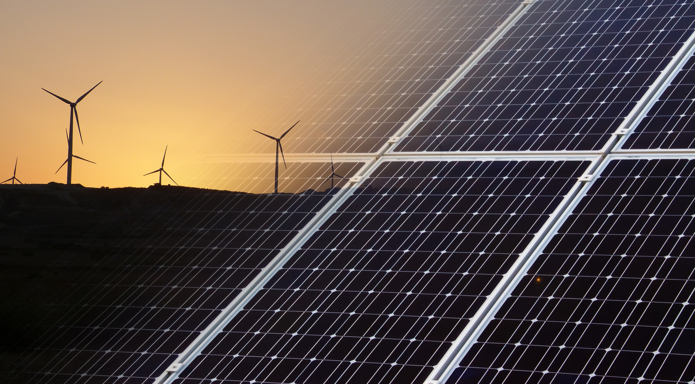

This is one of these rare circumstances this blog will touch on cryptocurrencies and not blockchains in general. More concretely this post is about one of the most debated topics within the cryptocurrency sphere. Energy consumption of the Bitcoin blockchain. All the arguments made from here equally apply to other proof of work cryptocurrencies.

I'm writing this article because I falsely assumed that pro-crypto people largely acknowledged that the energy consumption is bad and are either fine with it (necessary evil) or genuinely try to switch to cryptocurrencies on proof of stake blockchain. I was proven wrong by multiple conversations I read on Twitter and heard various podcasts. The way these discussions go is so insanely frustrating for one particular reason. A huge part of these debates is wasted on details about how big the percentage of renewable energies in Bitcoin mining is. This goes back and forth where one side mentions studies that are usually dismissed by the other side.

What is never mentioned is that in the big picture the renewable energy mix only matters when you assume that the amount of energy consumed doesn't matter as long as it has a zero carbon footprint. Let me explain:

**I can make the argument that Bitcoin mining has a net negative effect on society even if it is powered by 100% renewable energies.**

Let's dive into it

The first question I would ask in this scenario is: "How did we get here?". Because if your mining rig uses 100% renewables but you are effectively taking away that energy from nearby cities and industries when then results in them needing to fall back on coal and gas, that CO2 footprint is on you. So in this case the 100% renewables label is just greenwashing.

But let's assume the best intentions and also debunk another common pro-Bitcoin argument: "Bitcoin uses a lot of excess energy" meaning if you have a wind park that produces a lot of energy and only 70% of that energy is needed right now, you could use the 30% unused energy to mine Bitcoin - no one gets hurt. OK, so let's assume 100% of Bitcoin power consumption is renewable and is also 100% excess energy. If that's the case you are still confronted with two questions.

The first question is: Is mining Bitcoin really the best use case for excess energy? I acknowledge that excess energy should not happen and we should always find a use for it. The number one use that I can think of is any kind of energy storage: batteries, pumped storage hydropower or even creating hydrogen. Ultimately you'll have to justify the utility of Bitcoin over all of the other options out there.

The second question is: How can you make sure you don't open Pandora's box? Meaning: if energy providers start mining Bitcoin, they might run in a situation where mining Bitcoin is more profitable than selling the power to the energy market. This will inevitably cause the scenario I described above. Electricity is taken away from other use cases in favor of Bitcoin mining.

But I'm even willing to push it one step further. Let's assume we have a 100% renewable world where all of our energy production is carbon-free. Surely now Bitcoin mining is a non-issue, right?

Well, let's think about the bigger picture. Once we produce 100% of our energy carbon free (and realistically way before that and even today) we will have a societal debate about reducing our energy consumption overall. Because we cannot build more and more solar panels for obvious reasons. At some point we will run out of space and resources, so the only way forward is reducing the overall energy consumption.

There will be people who will advocate for using your electric car less or at least carpool. But regardless of that people will strive for optimization of existing technologies: batteries with lower storage loss, more energy-efficient electric motors, or better insulation in real estate.

This is where the Bitcoin network is fundamentally different from other technologies. There is no incentive to lower the power usage. Even if you optimize mining equipment to use 50% less energy for the same performance, there is no point to keep the hashing output constant. It is more profitable to double your hashing rate with the same power usage meaning buying twice the equipment. Competing miners will do the same and the power consumption of the network will stay the same while doubling the difficulty. Combine this with an increasing price and more miners will enter the market driving the overall energy consumption up.

## Conclusion

So in short: every increase in energy consumption needs to be justified. And that is true even if the energy source is renewable. And yes I know that gold mining, the banking system and even Christmas lights use a lot of energy as well but at the very least there is an incentive for everyone to lower the energy consumption of these systems. So the energy consumption argument for Bitcoin should never be about the exact percentage of green energy. It should rather be: "Is it worth it?". I answer this question with a clear: Hell no.

*Attribution: [Renewable Energy Environment](https://pixabay.com/photos/renewable-energy-environment-wind-1989416/) by [seagul](https://pixabay.com/users/seagul-191369)*

