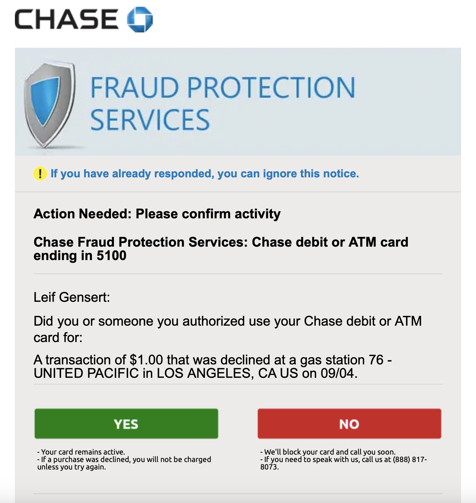

It's hard to live the modern world without being constantly reminded to stay vigilant on the internet. Apps of large financial institutes remind us not to wire money to individuals we don't know, online market places scan your messages for phone numbers and raise red flags if you take conversations outside their platform and companies above a certain size have internal phishing tests that punish you with online training if you click on one of their planted phishing links. So if you want to pay attention and be a good citizen of the online space, you will learn the rules to properly detect a false alert. So much so that I would argue most people's default reaction to a potential threat is just to ignore it ("it's probably a scam"). But do legitimate notifications about problem hold up to the scrutiny of a lay person's phishing awareness?

This is where I jump into my anecdote that happened to me in 2020 with Chase. Processes might have been improved in the meantime but it still illustrate the problem that regular people face when properly assessing if something is a real threat or not.

The backstory is as follows: I was on a long car trip and stopped at a gas station. For unimportant reasons I used my debit card instead of my credit card. The same night, while at a hotel I got an email from Chase notifying of a potential fraud of said card. The email looked like this:



I bought gas for more than $1. It might have been some kind of default charge by the gas station to verify my card details but it could have also been some kind of attempt to verify that my now stolen card number is working. Or it could have been an email by someone trying to impersonate Chase and it just conveniently aligned with my prior transaction at the gas station.

In any case the answer to the question "Did you or someone you authorized use your Chase debit or ATM card for: $1" I could very easily answer with: "No". So clicking the No button would have been the correct course of action if this email was indeed real.

There are a couple of indicators that told me that this is a legitimate email by Chase:

- They addressed me with my correct full name
- The email originated from a sub domain of the official chase domain (fraudalert.chase.com)
- The debit card I used matched the last 4 digits in the email

But because I had some time, I put on my paranoia hat and wondered: could this be a scam? How would I mitigate the risk of getting my money/information stolen. And to be honest, the main thing the threw me off a little was that the email looked nothing like Chase's corporate design at the time.

Let's go through commonly given advice from all the phishing advice I've ever gotten and see if we can categorize this email as a threat or phishing.

# Evaluate the Links in an Email

One of the more common pieces of advices is "if there is a link in an email, at least check the URL and see whether it is a URL associated with the bank/organization by hovering over the links". There are two prominent buttons in these emails, so let's verify where they are going:

```
http://tracking.csgipe.com/k/a/CIWZscg-TbBQdIu5mYmsp1~~/LEYJPOVI~/<344 ore characters>
```

This domain is pretty far removed from chase.com. So based on that advice you should not click any of the links in the email. I realize it is properly some URL forwarder with tracking but is it really that important in a fraud alert email or couldn't you have at least add your tracking codes as a URL parameter?

I however wanted to take it one step further. I realized that the URL probably just does a 3xx redirect and a simple curl request wouldn't hurt:

```
curl -v http://tracking.csgipe.com/k/a/CIWZscg-TbBQdIu5mYmsp1~~/LEYJPOVI~/...
...
< HTTP/1.1 302 Moved Temporarily
< Content-Type: text/plain
< Date: Sat, 09 Dec 2023 22:39:16 GMT
< Location: https://fraudalertresponse.chase.com/confirmactivity/?postbackObject=2023-01-11T16:44:26.204339;PTRC&uniqueId=XXXXXXXX&caseStatusCode=CONSUMER_CONFIRMED_OK&logoCode=CHS&language=EN&credit=true
```

So at least the forwarder goes to something.chase.com, but I don't think it's fair to expect consumers to understand the details of HTTP and be able to use command line tools. Not to mention that at the time I only had my phone and wouldn't have been able to spin up a terminal.

But let's continue.

# Try to Contact your Bank in a Different Way

One common advice is, when you get an email that requires action, don't immediately react, reach out to the organization in another way. The easiest way for me would have been to open the Chase app and verify that there I see the same fraud alert where I can then interact with it. I tried that, there was no alert whatsoever and even clicking through the menus did not show anything remotely related to that notification email.

Meaning that if I can't use Chase's app, the only way would have been to reach out via telephone. Which brings me to the next point.

# Don't Trust Telephone Numbers in Emails

If you look closely at the email, it provides a phone number to call (in small letters underneath the "No" button).

I don't know how high the bar is to register a 1-800 number but nevertheless, common advice given is to not trust phone numbers sent in an email and anecdotally there are even cases of people changing [bank's phone numbers on Google Maps](https://www.forbes.com/sites/leemathews/2018/11/26/fraudsters-change-bank-phone-numbers-on-google-maps-to-empty-victims-accounts/?sh=5a9db765503a). So if I were to call this number I at least wanted to be sure that it is a Chase owned phone number.

Chucking this number in Google mostly returned third party website where people claimed that it is a real Chase phone number but I wasn't able to find an official statement whether this number was actually a Chase number or not.

Verifying the other way also didn't help. Chase has a [dedicated website](https://www.chase.com/digital/resources/privacy-security/security/report-fraud) for contact information about fraud, but none of the numbers listed on the page matched the number in the email.

That means, just by going with phishing prevention advice, I should have not called the number in the email.

# What Did I Actually Do

The end of this is pretty unspectacular. I called the official Chase hotline. No one I spoke to was able to see or confirm the transaction, but I asked them to cancel the card and send me a new one.

# Conclusion

After some reflection on the case it became apparent to me that this was indeed a real email sent by Chase. I could have just clicked the "No" button instead of worrying so much. It might not be the best example of fraud alerts gone wrong, but it is one that I have still have documented.

I acknowledge that Chase has gotten better. Later versions of their fraud alerts are more aligned with the corporate design of their marketing emails and they removed the phone number. However they are still hiding all links behind tracking URLs.

Ultimately I know it's hard to prevent scams from happening but my point is:

**Properly design your outreach about fraud so that it doesn't raise any red flags:**

- Make sure the fraud email matches the corporate design of you other emails
- Give users an easy alternative to reach out
  - Either by having a similar alert when opening the app or
  - Have a menu item on the official hotline "If you have received a fraud notification press 7"

*Attribution: [Traffic Signs Attention](https://pixabay.com/illustrations/traffic-signs-attention-a-notice-464641/) by [geralt](https://pixabay.com/users/geralt-9301/)*
