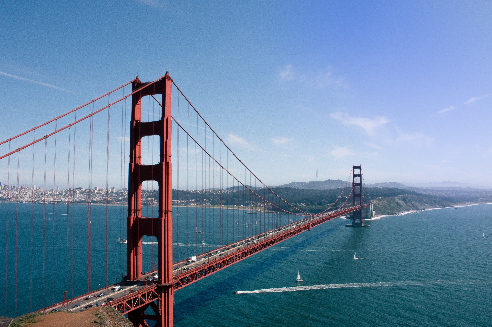

*Destinations from North to South*

# General Advice

## Car Rental

Best comparison site for car rentals is [carrentals.com](http://carrentals.com). If you don't have an American Driver's license the car rental companies will try to upsell you on car insurance.

Ideally contact your credit card company if there is a car insurance included within their service agreement.

## Where to stay while on the Road

You will save yourself a lot of trouble if you set milestones for the day. Seek out a hotel or motel for the night. Finding something last minute is sometimes tricky and the cell signal along the coastal highway is not great.

Just use a booking platform of your choice to seek out your stay for the end of the day.

## National Parks

California offers [9 National Parks](https://www.nps.gov/state/ca/index.htm) and a ton of National Monuments. The entrance admission fee varies from $25 to $35. If you are going to three or more, the [America the Beautiful](https://www.nps.gov/planyourvisit/passes.htm) is worth it. The annual pass costs $80 and grants entrance to all parks and monuments for a year. You can order it online or buy it directly at one of the parks. Additionally the outdoor store REI also sells these passes.

## Further Resources

- The best hiking resource that I use frequently is [AllTrails](https://www.alltrails.com). With the [Pro subscription](https://www.alltrails.com/pro) you can download trails on your phone which is often useful because most hiking trails don't have great reception. But even in the free version you'll get to explore popular trails and can find one that suits your level.
- For California in general, I recommend the blog [California through my Lens](http://californiathroughmylens.com) and the [YouTube Channel with the same name](https://www.youtube.com/channel/UCZFRs1R9ECKDwnLy5IQzwkg). There are tons of resources for pretty much all cities in California, National Parks and even specific road trip videos.
- San Francisco and the Bay Area have a very popular website specifically for inexpensive events called [FunCheap](http://funcheap.com).

---

# San Francisco / Bay Area

San Francisco is located in the northern part of California and is one of the most visited places in the Golden State. Even though San Francisco itself is not that big, the greater area it is located in (the Bay Area) has a population comparable to Los Angeles.

There is so much to see in the Bay area that you will probably have to compromise or stay more than a week. At the very least though make sure that your stay in the city includes a weekend.

## Weather

San Francisco is much colder than you think. If you are going without a jacket you will have an unpleasant surprise in the evening. As soon as the sun is gone it gets very cold and windy. You will also have a lot of fog in the morning and evening hours.

## Getting Around

[Uber](https://www.uber.com) and [Lyft](https://www.lyft.com) are the predominant ride share services in the US. Both of them started in the Bay Area and are widely available there. Prices can get very expensive especially during rush hour (we are talking $40+ for one ride).

But San Francisco has pretty decent public transport (for American standards). Not only do you have a tap in style travel card ([Clipper Card](https://www.clippercard.com)) you can also use your smartphone to tap for rides. Set up your phone before you arrive to have the best experience. The instructions can be found on the [official website](https://www.clippercard.com/ClipperWeb/pay-with-phone).

## Where to Stay

There are quite a few hotels that are affordable downtown. However, unlike European cities the downtown area of a big city may not be the best choice as some of these neighborhoods can be quite dangerous.

Neighborhoods that are well connected and fun to stay in are:

- Mission
- Hayes Valley
- The Castro
- Inner Sunset

## Restaurants & Bars

There is almost too many places to name them all but some of them stand out.

### [Burma Superstar](https://www.burmasuperstar.com)

You don't find that many Burmese restaurants even in California but this one is one of its kind. The lines are pretty long so bring enough to time to wait for a table.

## [SPARK Social](https://sparksocialsf.com)

A great outdoor space with varying food trucks in the Mission Bay neighborhood. An absolute must on a sunny day.

## Events

### [Off The Grid](https://offthegrid.com) (Every day across the whole Bay Area)

A collection of food trucks with absolute delicious food. Since 2015 they expanded a lot. The most iconic of these events is the one every Friday at Fort Mason. Check [the website](https://offthegrid.com) for the other days and locations.

### [Mortified @ The DNA Lounge](https://www.dnalounge.com/calendar/2022/04-08a.html) (Every 2nd Friday of the month)

Listen to regular people reading stories from their high school. Not only is it hilarious it presented in an absolute amazing way. Between the sets an improv rap group will retell the stories.

### [https://sf.nerdnite.com @ The Rickshaw Stop](https://sf.nerdnite.com) (Every 3rd Wednesday of the month)

The nerd nite is a global event that started in Boston. Experts from all fields hold talks on their areas of expertise. The San Francisco chapter is held at the Rickshaw Stop in Hayes Valley.
### [The Exploratorium After Dark (Every Thursday)](https://www.exploratorium.edu/visit/calendar/after-dark)

The science museum focused on mathematics and physics hosts a happy hour every Thursday night. Usually they also have science or magic shows and they are serving cocktails. An amazing way to experience the museum.

### [California Academy of Sciences Nightlife (Every Thursday)](https://www.calacademy.org/nightlife)

Similarly to the Exploratorium the other science museum also hosts a drink included Thursday night event. This museum includes an indoor rain forest and a planetarium.

### [Ruckus & Rumpus (formerly "Tourettes without Regrets")](https://www.ruckusandrumpusrevival.com)

The longest running variety show in the Bay Area. An absolute insane experience. It includes everything from roasts, battle rap sessions, stand up comedy, burlesque dance and all kinds of other frisky business. Check out their clips on YouTube to see if it is for you.

It is hosted in Oakland and goes well into the night so if you are staying in San Francisco you will have to take an Uber back.

The schedule is sporadic so check on the homepage for the next show.

## Outside Spots and Activities

As mentioned before, dress appropriately but once your set with good clothes start exploring the city and the Bay area.

### The Golden Gate Bridge

Even though the bridge symbolizes the city there are only a few spots in the city where you can actually see the bridge. The most common way visitor get to this site is using the San Francisco Cable car from Powell Street station. The line to enter is usually pretty long so bring some time with you. The cable car is just a regular form of public transportation so you can use your Clipper card. You might be able to save some time to walk up Powell St and get on the cable car on one of the subsequent stops.

### Dolores Park

Iconic views on SF downtown and a must see. Be careful: if you can't stand the smell of weed, don't go there.

### [Alcatraz](https://www.google.com/maps/place/Alcatraz+Island/@37.8189609,-122.4574523,14.13z/data=!4m5!3m4!1s0x8085811569574f23:0x189c28e85a71ae17!8m2!3d37.8266636!4d-122.4230122)

The former prison is another big tourist spot and on a nice day can be quite a fun experience.

Ticket lines are always long and there is no guarantee you will get a ticket for the same day. Ideally book your ticket in advance on [the official page](https://www.alcatrazislandtickets.com). Tickets for the day tour are usually available 1-2 weeks in advance. The night tour is usually sold out for 1+ months ahead.

### [Twin Peaks](https://www.google.com/maps/place/Twin+Peaks,+San+Francisco,+CA/@37.7532508,-122.460038,15z/data=!3m1!4b1!4m5!3m4!1s0x808f7e08425fbda7:0x2d9e2665b504b657!8m2!3d37.7544066!4d-122.4476845)

To get a nice overview of the bay and San Francisco downtown, make sure to check out this hill in the center of the city. If it's not too foggy you'll also see the Golden Gate Bridge and if you're lucky you might even see the ocean.

- Take the Muni train to the station Castro
- Take the bus from the other side of the street (**Market St & Castro St**) all the way up to **74 Crestline Dr**. from there it’s a 6 min walk to the top

### [Marshall's Beach / Baker Beach](https://www.google.com/maps/place/Marshall's+Beach/@37.8016512,-122.4886326,15z/data=!4m13!1m7!3m6!1s0x808586efe5358857:0xb46f784416a33e8e!2sMarshall's+Beach!3b1!8m2!3d37.8016521!4d-122.4798778!3m4!1s0x808586efe5358857:0xb46f784416a33e8e!8m2!3d37.8016521!4d-122.4798778)

Nice little beach with amazing views on the Golden Gate Bridge. Find detailed information on how to get there on [California Through My Lens](https://californiathroughmylens.com/marshalls-beach/) or make it a 9km hike with this [AllTrails Map](https://www.alltrails.com/explore/trail/us/california/presidio-and-baker-beach-loop-trail?u=m).

### Bike Ride to Sausalito

The cute little town located north of San Francisco is easily reachable via bike. The best part is: you only have to cycle one way because you can take the bike on the ferry back. There are a ton of bike rentals around Pier 41 who will give you detailed instructions. Just make sure you buy your ferry ticket back as soon as you arrive to Sausalito as the lines can be quite long.

A secret spot for great Mexican food is [Saylor’s Restaurant & Bar](http://saylorsrestaurantandbar.com). It is a little bit out of the way and only opens at 4pm but if you can make it is definitely worth it.

### Muir Woods

The National Monument is about an hour north of San Francisco. It is home to some of the most spectacular trees in North America. Cover charge is $15 per person or you can use the [America the Beautiful](https://www.nps.gov/planyourvisit/passes.htm) pass here.

It's a nice day trip with some great hikes nearby. [AllTrails](https://www.alltrails.com/parks/us/california/muir-woods-national-monument) has a nice overview of hikes in all difficulties.

---

# Yosemite National Park

**IMPORTANT: In the summer time you will need a reservation to enter the park. Even if you have a park pass already you will need to pick a reservation slot for the day of entrance. You can reserve a day on the [official website](https://www.nps.gov/yose/planyourvisit/reservations.htm).**

Often rated as the best National Park in all of the US, Yosemite National park is an absolute highlight. Although not anywhere close to the coast, the 3 hour detour from San Francisco is worth it.

## Where to Stay

Yosemite's popularity is reflected in its prices. There are not a lot of hotels within the park and the ones that are, are super expensive (prices are easily $500 a night). So you might want to look into accommodation that is not directly in the park but a short car ride away.

Coming from San Francisco, the most convenient entrance to the park is [Arch Rock Entrance](https://www.google.com/maps/@37.6779886,-119.7487934,200m/data=!3m1!1e3).

The closest town to Yosemite is [Mariposa](https://www.google.com/maps/@37.680497,-119.7738029,15.2z) which is ~50 minutes to the entrance.

### [Yosemite View Lodge](https://www.yosemiteresorts.com/yosemite-view-lodge)

The most convenient hotel for the Arch Rock Entrance is the [Yosemite View Lodge](https://www.yosemiteresorts.com/yosemite-view-lodge/). It is just a 5 minutes drive to the entrance and very conveniently located. Room prices start around $229 even during the week.

### [Yosemite Cedar Lodge](https://www.yosemiteresorts.com/cedar-lodge/)

Only 15 minutes from the entrance the Cedar Lodge is slightly cheaper with rooms starting at $189.

### [Yosemite Bug Rustic Mountain Resort](https://www.yosemitebug.com)

If you are willing to stay a little further from the entrance (40 minutes drive) this hostel is a cheaper alternative with bunk beds starting at $44 (per bed).

---

# Santa Cruz

A surfers paradise that is worth a short visit. Here are some of the highlights.

## Boardwalk

An amusement park right at the ocean. Next to it an all American arcade with some fun games.

## [Shadowbrook](https://www.shadowbrook-capitola.com)

Fancy(ish) restaurant that includes a trolly. Amazing ambiance.

---

# Monterey

## [17 Mile Drive](https://www.pebblebeach.com/17-mile-drive/)

The scenic road through Pebble Beach offers some great views on the Monterey peninsula. The admission fee is $11.25 per vehicle but will be reimbursed with a $35 purchase at the Pebble Beach resort.

---

# Big Sur

## Bixby Bridge

The number one landmark that comes up when you type "Big Sur" into Google. 20 miles south of Monterey, be sure to stop and take some pictures for the memories.

---

# Santa Barbara

From all the coastal cities along Highway 1, Santa Barbara is one of the prettiest. It combines a nice coast line together with beautiful mountain ranges.  Make sure to stop here during the day and walk around the beautiful white buildings.

## [Hot Springs Canyon Trail](https://www.alltrails.com/explore/trail/us/california/hot-springs-canyon-trail)

If you have 3-4 hours to spare, you should definitely hike the Hit Springs Canyon Trail. It's an easy to medium hike that ends at natural hot springs and offers amazing views. Even most locals don't know this place.

The start of the hike only offers a handful of parking spots and it is located in a wealthy neighborhood. So if you are parking where you're not supposed to you will definitely be fined. So come early (7am or earlier) or even better, park your car in the city and Uber/Lyft to the trailhead.

---

# Santa Monica / Venice

If you want a true LA feeling Santa Monica is the place to be. Take a stroll on the famous Santa Monica pier and if you feel like walking more walk all the way south to Venice and take some pictures at Muscle Beach.

---

# Los Angeles

There are two kinds of people in California. Those who hate Los Angeles and those who live there. The more nuanced take is that Los Angeles is a major metropolitan area with everything that big cities offer. Nice restaurants, concerts, night life and art.

Here are just some of the activities that I enjoyed while visiting the area.

## Hollywood Boulevard (Walk of Fame)

Seeing the walk of fame is something you should if you haven't already done it. Download one of the "Walk of Fame" apps and find your favorite celebrity on the street.

Stroll by the Chinese theater and have a look where the Oscars are hosted.

Otherwise there is not that much to see here. It's really not worth visiting a second time.

## [Hiking the Hollywood Sign](https://www.alltrails.com/trail/us/california/hollywood-sign-via-canyon-drive)

Hiking the iconic LA landmark is a nice 10km moderate hike that offers you a great view on LA downtown, Santa Monica and the San Fernando Valley on the other side.

Bring lots of water and check the weather. There is little to now shade on the way up.

## The Getty (museum)

Open since 1997 the area around The Getty offers great views on LA. The entrance to the museum is free you just have to pay for parking ($20).

# Santa Catalina Island

If you can spare two days, book a ferry to this lovely island. Ferry's are going via two companies: [Catalina Flyer](https://www.catalinainfo.com) from Newport Beach and [Catalina Express](https://www.catalinaexpress.com) from San Pedro, Long Beach and Dana Point. If you book a hotel through the [Visit Catalina Island](https://www.visitcatalinaisland.com) homepage you can choose a room together with the ferry ride and save a few dollars. The main place to stay is Avalon which is also the capital city of Catalina Island. Two harbours can only be accessed via ferry from San Pedro and is more remote with only a handful of restaurants and hotels.

Similarly to Yosemite staying over night can be pricy. I had great experiences with the [Atwater Hotel](https://www.visitcatalinaisland.com/lodging/avalon/hotel-atwater/) where the nights start at $230. For a cheaper stay I recommend the [Seacrest Inn](https://www.seacrestinncatalina.com) with rates as low as $160.

For food try out the [Bluewater Avalon](https://www.bluewatergrill.com/location/catalina-island/).

Make sure to do at least one hike. I recommend: [Hermit Gulch Trail to Lone Tree Point](https://www.alltrails.com/explore/trail/us/california/hermit-gulch-trail-to-lone-tree-point)

---

# Joshua Tree National Park

The second National Park and beautiful desert. If you're in the area definitely give it a visit. The closest town to stay in is [Twentynine Palms](https://de.wikipedia.org/wiki/Twentynine_Palms), if you want a bigger city to stay at, [Palm Springs](https://en.wikipedia.org/wiki/Palm_Springs,_California) is less about an hour car ride away.

One hike that is great for sunset is the [Ryan Mountain Trail](https://www.alltrails.com/trail/us/california/ryan-mountain-trail). It offers a great view over the whole landscape.

In 2017 Joshua Tree was designated as an International Dark Sky Park, so if you're into astronomy this is an excellent area for stargazing.

---

# San Diego

Last but not least, my home of San Diego. Located right at the Mexican border, San Diego area offers a great
mix of beach, city life, mountains and desert.
## Where to Stay

Obviously [Casa Mika](https://www.airbnb.com/h/casa-mika).

---

# Attribution

- [Cover](https://unsplash.com/photos/SxDrqGvFxaA) by [Mattia Bericchia](https://unsplash.com/@mattiabericchia)
- [San Francisco](https://unsplash.com/photos/bUNrZjroK2o) by [Elie Khoury](https://unsplash.com/@eliekhoury)
- [Golden Gate Bridge](https://pixabay.com/photos/golden-gate-bridge-san-francisco-925547/) by [StockSnap](https://pixabay.com/users/stocksnap-894430/)
- [Alcatraz](https://unsplash.com/photos/cjn9CpnXn30) by [Nikolay Tchaouchev](https://unsplash.com/@nxn)
- [Baker Beach](https://pixabay.com/photos/bridge-golden-gate-sea-sunset-1333645) by [itsara](https://pixabay.com/users/itsara-2365440/)
- [Sausalito](https://pixabay.com/photos/sausalito-california-ca-water-737187/) by [eyeImage](https://pixabay.com/users/eyeimage-952081/)
- [Muir Woods](https://pixabay.com/photos/walking-path-nature-outdoors-1079940/) by [Linnaea_Mallette](https://pixabay.com/users/linnaea_mallette-1739502/)
- [Yosemite](https://unsplash.com/photos/Y0pPGqqMMYk) by [Stephen Leonardi](https://unsplash.com/@stephenleo1982)
- [Bixby Bridge](https://unsplash.com/photos/lsOy-suy2-g) by [Dave Lastovskiy](https://unsplash.com/@dlasto)
- [Santa Barbara](https://pixabay.com/photos/santa-barbara-view-panorama-usa-2965789) by [Arianna Morabito](https://pixabay.com/users/ariannamorabito-6814148)
- [Catalina Island](https://unsplash.com/photos/04XNzQvnI84) by [Tony Mucci](https://unsplash.com/@eklect)
- [Joshua Tree](https://pixabay.com/photos/astronomy-milkyway-galaxy-7154558/) by [Ken Guinn](https://pixabay.com/users/kenguinn-5420876)
- [San Diego](https://pixabay.com/photos/usa-california-san-diego-2778351/) by [dfsym](https://pixabay.com/users/dfsym-1983299)
